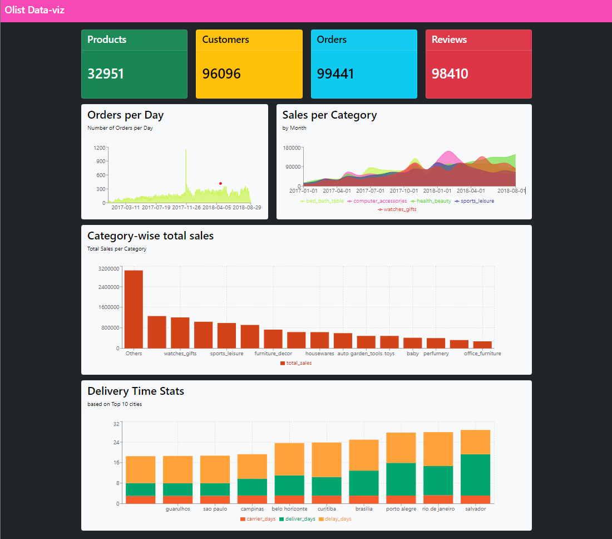
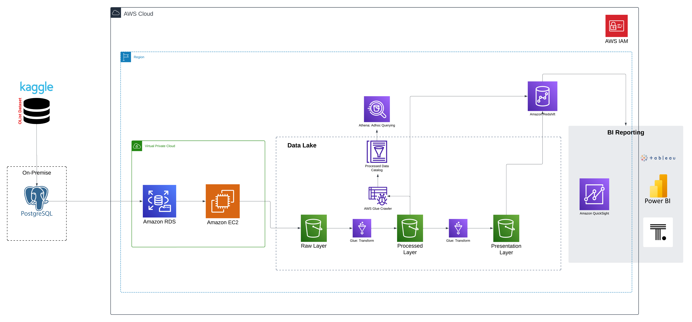
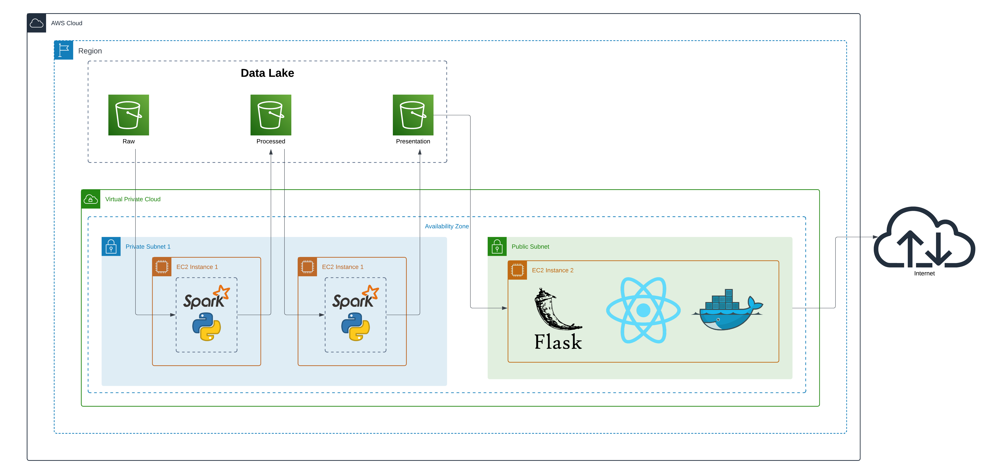

# OLIST Data Engineering Project 😍

A batch processing 🔧 Data Engineering/ Data Analytics project to get familiarized with different AWS services. I have tried incorporating as many real world AWS services as possible to build the architecture. However, since pricing 💸💸💸 is a concern and the dataset is relatively 🤏, I built 💪 a dashboard using React and Flask 🌐 as alternative of using Quicksight 🔍. I also used some free workaround for building AWS Glue jobs and performed the ETL using pyspark on my local. For easy development, I used google colab (I ❤️ colab), althought using Databricks 🧱 community version is also an alternative.

## Dashbaord

Dashboard build with React + Vite and Bootstrap.



## Architecture

The architecture is a walkthrough of how a big data ETL pipeline can be built in AWS. We assume that the data is present in a local database instance (in the real world the Postgres database will be hosted in company data centers). A common requirement might be to first migrate the data to a AWS RDS postgres database. Then with the help of a lambda or python code, we can ship the data to a 'Raw Zone' and save it in .csv or the format we like. Next, following the medallion architecture, we would be developing PySpark based data ingestion and data transformation codes. AWS provides AWS Glue to achieve such objectives.
Next, in a typical data pipeline, one would want to analyze the data from the processed layer for performing some EDA. This can be done by building Glue Catalogs and then analyzing the processed data (typically saved in parquet) in AWS Athena or any other adhoc query tool. After the data is ready for presentation, in a medallion architecture, typically the data from both processed and presentation zones would be stored in a data warehouse. Finally, this data will be visualized/ analyzed in a BI reporting tool such as AWS Quicksight (offered by AWS), Tableau, Power BI, Thoughtspot etc.


The architecture is a walkthrough of how a big data ETL pipeline can be built in AWS. We assume that the data is present in a local database instance (in the real world the Postgres database will be hosted in company data centers). A common requirement might be to first migrate the data to a AWS RDS postgres database. Then with the help of a lambda or python code, we can ship the data to a 'Raw Zone' and save it in .csv or the format we like. Next, following the medallion architecture, we would be developing PySpark based data ingestion and data transformation codes. AWS provides AWS Glue to achieve such objectives.
Next, in a typical data pipeline, one would want to analyze the data from the processed layer for performing some EDA. This can be done by building Glue Catalogs and then analyzing the processed data (typically saved in parquet) in AWS Athena or any other adhoc query tool. After the data is ready for presentation, in a medallion architecture, typically the data from both processed and presentation zones would be stored in a data warehouse. Finally, this data will be visualized/ analyzed in a BI reporting tool such as AWS Quicksight (offered by AWS), Tableau, Power BI, Thoughtspot etc.

Findings:
```raw
    1. Costly to run Glue Jobs.
    2. Better to use pyspark locally/ using google colab or other third party services as I built a personal data engineering project.
    3. Since Redshift and Quicksight incurs some billing amount, a flask server can be built to read data from the
    presentation layer. The frontend can then be built in React to build dashboards.
    4. For better learning, I used an EC2 instance that hosted the dashboard built with Flask and React. In the free tier, running an
    2. Better to use pyspark locally/ using google colab or other third party services as I built a personal data engineering project.
    3. Since Redshift and Quicksight incurs some billing amount, a flask server can be built to read data from the
    presentation layer. The frontend can then be built in React to build dashboards.
    4. For better learning, I used an EC2 instance that hosted the dashboard built with Flask and React. In the free tier, running an
    EC2 instance is free for 750 hours a month.
    
```
### Cost inducing solution (Do not use AWS Glue, Athena, Redshift and Quicksight if billing is a concern)



### Almost zero cost alternative 💯 🚀 !!!

If using AWS services like Glue, Athena and Quicksight, which are not in the free tier subscription, too expensive for you, working with free alternatives also should work fine as long as the datasets you are processing consume less resources. Spinning up a virtual machine with ubuntu (working with Windows was'nt helpful for me as I had issues connecting pyspark to s3) or using WSL might also work for your pyspark workload. Also to visualize data, using Flask and React to build dashboards (dynamic) might also be a good development experience for many.
If using AWS services like Glue, Athena and Quicksight, which are not in the free tier subscription, too expensive for you, working with free alternatives also should work fine as long as the datasets you are processing consume less resources. Spinning up a virtual machine with ubuntu (working with Windows was'nt helpful for me as I had issues connecting pyspark to s3) or using WSL might also work for your pyspark workload. Also to visualize data, using Flask and React to build dashboards (dynamic) might also be a good development experience for many.
I followed the architecture diagram below starting from the raw zone in s3 all the way up to dashboarding with React. This costed me $0 dollars as running a flask server on an EC2 instance is free for 750 hours/month for a year.



Notes:
```raw
    1. Running the EC2 instance is also not required. One can do this on local as well.
    2. This will work pretty well for smaller datasets. For larger datasets (Enterprise level) this architecture
    might not work. For large datasets, one would ofcourse use a data warehousing solution with AWS Glue/ Databricks/
    AWS lambda (for medium sized data) as their ETL solution.
    3. Building the project this way gave me some knowledge 🧠 on building Flask Servers + React for simple
``` 

Data Source (Brazilian E-Commerce Publuc Dataset by Olist)

Kaggle: https://www.kaggle.com/datasets/olistbr/brazilian-ecommerce?select=olist_order_items_dataset.csv