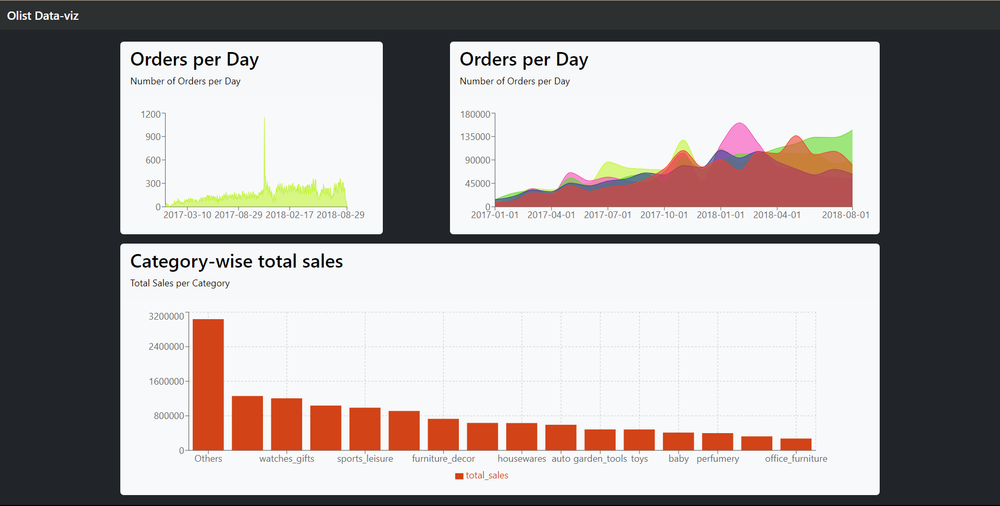

# OLIST Data Engineering Project 😍

A batch processing 🔧 Data Engineering/ Data Analytics project to get familiarized with different AWS services. I have tried incorporating as many real world AWS services as possible to build the architecture. However, since pricing 💸💸💸 is a concern and the dataset is relatively 🤏, I built 💪 a dashboard using React and Flask 🌐 as alternative of using Quicksight 🔍. I also used some free workaround for building AWS Glue jobs and performed the ETL using pyspark on my local. For easy development, I used google colab (I ❤️ colab), althought using Databricks 🧱 community version is also an alternative.

## Dashbaord

Dashboard build with React + Vite and Bootstrap.



## Architecture
Findings:
```raw
    1. Costly to run Glue Jobs.
    2. Better to use pyspark locally/ using google colab or other third party services
    3. Since Redshift and Quicksight incurs some billing amount, a flask server is built to read data from the
    presentation layer and then the frontend can be built in React.JS to show the visualizations properly.
    4. For better support, use an EC2 instance that would run the flask server. In the free tier, running an
    EC2 instance is free for 750 hours a month.
    5. Good to know how the services work for batch data processing.
```
### Cost inducing solution (Do not use AWS Glue, Athena, Redshift and Quicksight if billing is a concern)


### Almost zero cost alternative 💯 🚀 !!!

If using AWS services like Glue, Athena and Quicksight which are not in the free tier subscription too expensive for you, working with free alternatives also should work fine as long as the datasets you are processing consumes less resources. Spinning up a virtual machine with ubuntu (working with Windows was'nt helpful for me as I had issues connecting pyspark with s3) or using WSL might also work for your pyspark workload. Also to visualize data, using Flask and React to build dashboards (dynamic) might also be a good development experience for many.
I followed the architecture diagram below starting from the raw zone in s3 all the way up to dashboarding with React. This costed me $0 dollars as running a flask server on an EC2 instance is free for 750 hours/month for a year.


Notes:
```raw
    1. Running the EC2 instance is also not required. One can do this on local as well.
    2. This will work pretty well for smaller datasets. For larger datasets (Enterprise level) this architecture
    might not work. For large datasets, one would ofcourse use a data warehousing solution with AWS Glue/ Databricks/
    AWS lambda (for medium sized data) as their ETL solution.
    3. Building the project this way gave me some knowledge 🧠 on building Flask Servers + React for simple
    dashboarding.
```  